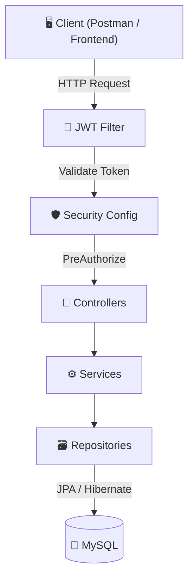
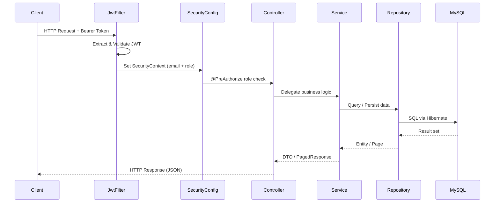
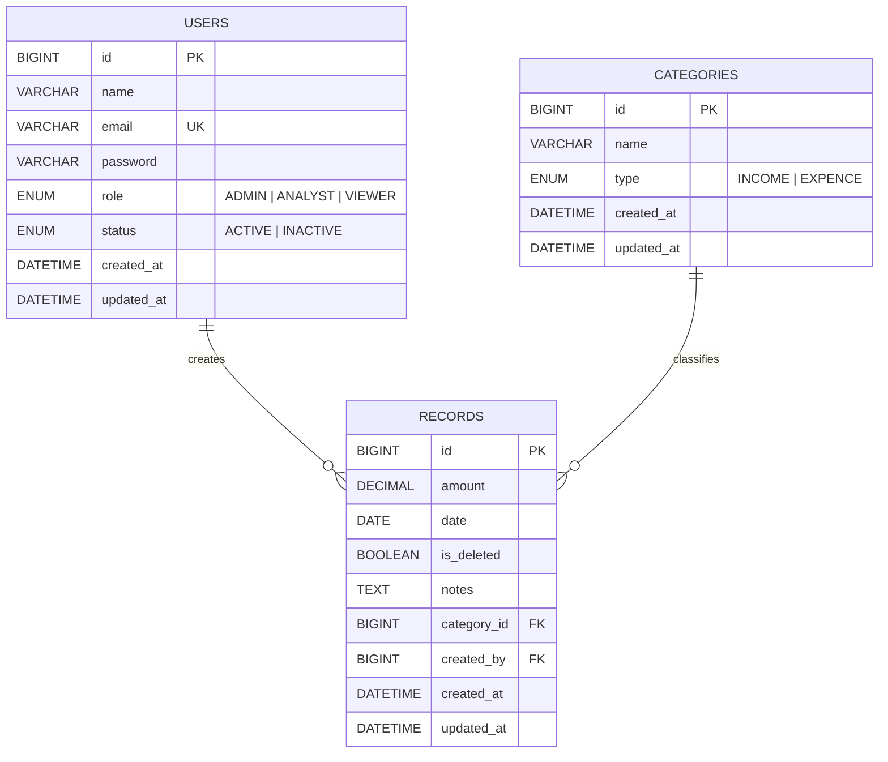

# 💰 Finance Dashboard — REST API

A production-grade **Spring Boot REST API** for managing personal and organizational finances. Track income, expenses, view dashboard analytics, and manage users — all secured with **JWT authentication** and **role-based access control (RBAC)**.

[](https://openjdk.org/)
[](https://spring.io/projects/spring-boot)
[](https://www.mysql.com/)
[](LICENSE)

---

## 📑 Table of Contents

- [Architecture](#-architecture)
- [Tech Stack](#-tech-stack)
- [Project Structure](#-project-structure)
- [Getting Started](#-getting-started)
- [Environment Variables](#-environment-variables)
- [Authentication Flow](#-authentication-flow)
- [Role-Based Access Control](#-role-based-access-control)
- [API Reference](#-api-reference)
  - [Auth](#1-authentication)
  - [Users](#2-user-management)
  - [Categories](#3-category-management)
  - [Financial Records](#4-financial-records)
  - [Dashboard](#5-dashboard--analytics)
- [Pagination](#-pagination)
- [Error Handling](#-error-handling)
- [Database Schema](#-database-schema)

---

## 🏗 Architecture



### Request Lifecycle



---

## 🧰 Tech Stack

| Layer | Technology |
|---|---|
| **Language** | Java 17 |
| **Framework** | Spring Boot 3.5 |
| **Security** | Spring Security + JWT (jjwt 0.11.5) |
| **Database** | MySQL 8.0 |
| **ORM** | Spring Data JPA / Hibernate |
| **Build** | Maven |
| **Env Management** | spring-dotenv |

---

## 📁 Project Structure

```
src/main/java/com/Zorvyn/FinanceApp/
├── config/
│   └── SecurityConfig.java          # JWT filter chain, CORS, session policy
├── controller/
│   ├── AuthController.java          # /api/auth — register, login
│   ├── UserController.java          # /api/users — CRUD (Admin only)
│   ├── CategoryController.java      # /api/category — income/expense categories
│   ├── FinanceRecordController.java # /api/records — financial transactions
│   └── DashBoardController.java     # /api/dashboard — analytics
├── dto/
│   ├── request/                     # Incoming request bodies
│   └── response/                    # Outgoing response bodies
├── entity/
│   ├── User.java
│   ├── Category.java
│   └── Records.java
├── enums/
│   ├── Roles.java                   # ADMIN, ANALYST, VIEWER
│   ├── Status.java                  # ACTIVE, INACTIVE
│   └── CategoryType.java           # INCOME, EXPENCE
├── exception/                       # Custom exceptions + global handler
├── filter/
│   └── JwtFilter.java               # OncePerRequestFilter for JWT
├── repository/                      # Spring Data JPA interfaces
├── service/                         # Service interfaces
│   └── implement/                   # Service implementations
└── FinanceAppApplication.java       # Entry point
```

---

## 🚀 Getting Started

### Prerequisites

- **Java 17+**
- **Maven 3.8+**
- **MySQL 8.0+**

### 1. Clone the Repository

```bash
git clone https://github.com/shorabh-songara/FinanceDashBoard.git
cd FinanceDashBoard
```

### 2. Create the MySQL Database

```sql
CREATE DATABASE finance_db;
```

### 3. Configure Environment Variables

Create a `.env` file in the project root:

```env
# ── Database Configuration ──
DB_URL=jdbc:mysql://localhost:3306/finance_db
DB_USERNAME=root
DB_PASSWORD=your_password

# ── JPA / Hibernate ──
JPA_DDL_AUTO=update
JPA_SHOW_SQL=true

# ── JWT Configuration ──
JWT_SECRET=your_256_bit_hex_secret_key_here
JWT_EXPIRATION=86400000
```

> ⚠️ **Important:** The `.env` file is in `.gitignore` and will never be committed. Each developer must create their own.

### 4. Run the Application

```bash
./mvnw spring-boot:run
```

The server starts on **http://localhost:8080**.

### 5. Create the First Admin Account

Since registration creates users with `VIEWER` role and `INACTIVE` status, the first admin must be seeded manually in MySQL:

```sql
-- Generate a BCrypt hash for your password first (use an online tool or Spring's PasswordEncoder)
INSERT INTO users (name, email, password, role, status, created_at, updated_at)
VALUES (
  'Admin',
  'admin@zorvyn.com',
  '$2a$10$YOUR_BCRYPT_HASH_HERE',
  'ADMIN',
  'ACTIVE',
  NOW(),
  NOW()
);
```

After this, the admin can create other users with any role via `POST /api/users`.

---

## 🔐 Authentication Flow


### Step-by-Step

1. **Register** → `POST /api/auth/register` (public, creates `VIEWER` + `INACTIVE`)
2. **Admin Activates** → `PUT /api/users/{id}` (admin sets `status: ACTIVE`)
3. **Login** → `POST /api/auth/login` (returns JWT token)
4. **Use Token** → Add `Authorization: Bearer <token>` header to all subsequent requests

---

## 🛡 Role-Based Access Control

Authorization is enforced via `@PreAuthorize` annotations on every controller method.

| Endpoint | ADMIN | ANALYST | VIEWER | Public |
|---|:---:|:---:|:---:|:---:|
| `POST /api/auth/register` | — | — | — | ✅ |
| `POST /api/auth/login` | — | — | — | ✅ |
| `* /api/users/**` | ✅ | ❌ | ❌ | ❌ |
| `POST /api/category` | ✅ | ❌ | ❌ | ❌ |
| `GET /api/category/{id}` | ✅ | ✅ | ✅ | ❌ |
| `PUT /api/category/{id}` | ✅ | ❌ | ❌ | ❌ |
| `DELETE /api/category/{id}` | ✅ | ❌ | ❌ | ❌ |
| `POST /api/records` | ✅ | ❌ | ❌ | ❌ |
| `GET /api/records` | ✅ | ✅ | ✅ | ❌ |
| `PUT /api/records/{id}` | ✅ | ✅ | ❌ | ❌ |
| `DELETE /api/records/{id}` | ✅ | ✅ | ❌ | ❌ |
| `PATCH /api/records/{id}/restore` | ✅ | ✅ | ❌ | ❌ |
| `GET /api/dashboard/**` | ✅ | ✅ | ✅ | ❌ |

---

## 📡 API Reference

> **Base URL:** `http://localhost:8080`
>
> **Auth Header:** `Authorization: Bearer <jwt_token>` (required for all endpoints except `/api/auth/**`)

---

### 1. Authentication

#### Register a New User

```http
POST /api/auth/register
Content-Type: application/json
```

```json
{
  "name": "John Doe",
  "email": "john@example.com",
  "password": "secret123"
}
```

**Response** `200 OK`
```json
{
  "success": true,
  "message": "User registered successfully"
}
```

> **Note:** Registered users are created with role `VIEWER` and status `INACTIVE`. An admin must activate the account before the user can log in.

---

#### Login

```http
POST /api/auth/login
Content-Type: application/json
```

```json
{
  "email": "admin@zorvyn.com",
  "password": "Admin@123"
}
```

**Response** `200 OK`
```json
{
  "token": "eyJhbGciOiJIUzI1NiIsInR...",
  "message": "Login successful. Welcome back Admin."
}
```

---

### 2. User Management

> 🔒 **All endpoints require `ADMIN` role**

#### Create User

```http
POST /api/users
Authorization: Bearer <token>
Content-Type: application/json
```

```json
{
  "name": "Jane Smith",
  "email": "jane@example.com",
  "password": "password123",
  "role": "ANALYST",
  "status": "ACTIVE"
}
```

**Response** `201 Created`
```json
{
  "id": 2,
  "name": "Jane Smith",
  "email": "jane@example.com",
  "role": "ANALYST",
  "status": "ACTIVE",
  "createdAt": "2026-04-06T09:30:00"
}
```

#### Get All Users (with filters & pagination)

```http
GET /api/users?search=jane&role=ANALYST&status=ACTIVE&page=0&size=10
Authorization: Bearer <token>
```

| Parameter | Type | Required | Description |
|---|---|---|---|
| `search` | String | No | Search by name or email |
| `role` | Enum | No | Filter by role: `ADMIN`, `ANALYST`, `VIEWER` |
| `status` | Enum | No | Filter by status: `ACTIVE`, `INACTIVE` |
| `page` | Integer | No | Page number (0-indexed). Enables pagination |
| `size` | Integer | No | Items per page (default: 10) |

#### Get User by ID

```http
GET /api/users/{id}
Authorization: Bearer <token>
```

#### Get Inactive/Pending Users

```http
GET /api/users/inactive
Authorization: Bearer <token>
```

#### Update User

```http
PUT /api/users/{id}
Authorization: Bearer <token>
Content-Type: application/json
```

```json
{
  "name": "Jane Updated",
  "role": "ADMIN",
  "status": "ACTIVE"
}
```

> Only provided fields are updated. Omitted fields remain unchanged.

#### Delete User

```http
DELETE /api/users/{id}
Authorization: Bearer <token>
```

**Response** `200 OK`
```json
{
  "success": true,
  "message": "User deleted successfully"
}
```

---

### 3. Category Management

Categories classify financial records as either **INCOME** or **EXPENCE**.

#### Create Category

```http
POST /api/category
Authorization: Bearer <token>
Content-Type: application/json
```

```json
{
  "name": "Salary",
  "type": "INCOME"
}
```

> 🔒 Requires `ADMIN` role

#### Get Category by ID

```http
GET /api/category/{id}
Authorization: Bearer <token>
```

> Accessible to `ADMIN`, `ANALYST`, `VIEWER`

#### Update Category

```http
PUT /api/category/{id}
Authorization: Bearer <token>
Content-Type: application/json
```

```json
{
  "name": "Monthly Salary",
  "type": "INCOME"
}
```

> 🔒 Requires `ADMIN` role

#### Delete Category

```http
DELETE /api/category/{id}
Authorization: Bearer <token>
```

> 🔒 Requires `ADMIN` role

---

### 4. Financial Records

#### Create Record

```http
POST /api/records
Authorization: Bearer <token>
Content-Type: application/json
```

```json
{
  "amount": 50000.00,
  "categoryId": 1,
  "date": "2026-04-01",
  "notes": "March salary credited"
}
```

> 🔒 Requires `ADMIN` role. The `createdBy` field is auto-populated from the JWT.

#### Get All Records (with filters & pagination)

```http
GET /api/records?categoryName=salary&type=INCOME&from=2026-01-01&to=2026-12-31&page=0&size=10
Authorization: Bearer <token>
```

| Parameter | Type | Required | Description |
|---|---|---|---|
| `categoryName` | String | No | Search by category name (partial match) |
| `type` | Enum | No | Filter: `INCOME` or `EXPENCE` |
| `from` | Date | No | Start date (`yyyy-MM-dd`) |
| `to` | Date | No | End date (`yyyy-MM-dd`) |
| `limit` | Integer | No | Max results (non-paginated mode only) |
| `page` | Integer | No | Page number (0-indexed). Enables pagination |
| `size` | Integer | No | Items per page (default: 10) |

> Accessible to `ADMIN`, `ANALYST`, `VIEWER`

#### Update Record

```http
PUT /api/records/{id}
Authorization: Bearer <token>
Content-Type: application/json
```

```json
{
  "amount": 55000.00,
  "notes": "Updated: March salary + bonus"
}
```

> 🔒 Requires `ADMIN` or `ANALYST` role

#### Delete Record (Soft Delete)

```http
DELETE /api/records/{id}
Authorization: Bearer <token>
```

> Records are **soft deleted** (`isDeleted = true`). They won't appear in queries but remain in the database.

#### Restore Deleted Record

```http
PATCH /api/records/{id}/restore
Authorization: Bearer <token>
```

> 🔒 Requires `ADMIN` or `ANALYST` role

---

### 5. Dashboard & Analytics

> Accessible to `ADMIN`, `ANALYST`, `VIEWER`

#### Financial Summary

```http
GET /api/dashboard/summary
Authorization: Bearer <token>
```

**Response** `200 OK`
```json
{
  "totalIncome": 150000.00,
  "totalExpenses": 45000.00,
  "netBalance": 105000.00
}
```

#### Category-wise Totals

```http
GET /api/dashboard/CategoryTotal
Authorization: Bearer <token>
```

**Response** `200 OK`
```json
[
  { "categoryName": "Salary", "categoryType": "INCOME", "total": 150000.00 },
  { "categoryName": "Rent", "categoryType": "EXPENCE", "total": 25000.00 },
  { "categoryName": "Groceries", "categoryType": "EXPENCE", "total": 20000.00 }
]
```

#### Monthly Trends

```http
GET /api/dashboard/monthlyTrend?year=2026
Authorization: Bearer <token>
```

| Parameter | Type | Required | Description |
|---|---|---|---|
| `year` | Integer | No | Year to fetch trends for (defaults to current year) |

**Response** `200 OK`
```json
[
  {
    "year": 2026,
    "month": 1,
    "monthName": "January",
    "income": 50000.00,
    "expenses": 15000.00,
    "netBalance": 35000.00
  },
  {
    "year": 2026,
    "month": 2,
    "monthName": "February",
    "income": 50000.00,
    "expenses": 18000.00,
    "netBalance": 32000.00
  }
]
```

#### Recent Activity

```http
GET /api/dashboard/recentActivity?limit=5
Authorization: Bearer <token>
```

| Parameter | Type | Required | Description |
|---|---|---|---|
| `limit` | Integer | No | Number of recent records (default: 10) |

---

## 📄 Pagination

Endpoints that support pagination (`/api/users`, `/api/records`) return a `PagedResponse` when `page` or `size` query params are provided:

```json
{
  "content": [
    { "id": 1, "..." : "..." },
    { "id": 2, "..." : "..." }
  ],
  "page": 0,
  "size": 10,
  "totalElements": 25,
  "totalPages": 3,
  "last": false
}
```

| Field | Description |
|---|---|
| `content` | Array of items for the current page |
| `page` | Current page number (0-indexed) |
| `size` | Number of items per page |
| `totalElements` | Total number of matching items across all pages |
| `totalPages` | Total number of pages |
| `last` | `true` if this is the last page |

> **Backward Compatible:** If `page` and `size` are omitted, the API returns a plain JSON array (non-paginated).

---

## ❌ Error Handling

All errors follow a consistent format:

```json
{
  "status": 400,
  "message": "Email cannot be blank",
  "timestamp": "2026-04-06T09:30:00"
}
```

| HTTP Code | Meaning |
|---|---|
| `400` | Bad Request — validation failed |
| `401` | Unauthorized — missing or invalid JWT |
| `403` | Forbidden — insufficient role |
| `404` | Not Found — resource doesn't exist |
| `500` | Internal Server Error |

---

## 🗄 Database Schema



---

## 📜 License

This project is open source under the [MIT License](LICENSE).

---

<p align="center">
  Built with ❤️ by <a href="https://github.com/shorabh-songara">Shorabh Songara</a> — Zorvyn
</p>
